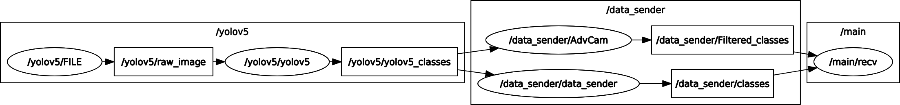

# E2E_Camera

실행방법의 경우 3번으로
> 
> ### 1. 노드 구조 (KOR)
> </img><br/>
> detector의 data loader code와 detector코드가 하나의 그룹을 이룬다.    
>     
> 예시에서는 영상을 input으로 지정하는 filelaunch가 사용되었으며 FILE, yolov5라는 Node가 생성되었음을 확인할 수 있다.     
>     
> 다음으로는 detector의 결과를 취합해 외부 모듈로 전송하는 data_sender node와 AdvCam node가 하나의 그룹 data_sender를 이룬다.
> data_sender는 단순히 데이터를 취합해 외부 모듈로 전송하는 역할만을 수행하고, AdvCam은 해당 데이터를 후철해주는 node이다.
> #### 1.1 카메라 입력
>> scripts/Camera_code에 해당하는 부분이다. 자신이 사용하고자 하는 카메라에 대응되는 코드를 찾거나, 직접 작성하여 Camera_code폴더 내에
>> 위치시킨다.
>> 이때 카메라 코드는 ***sensor_msg.Image***의 형식을 따르도록 한다.    
> rostopic의 경우 혼란의 방지를 위헤 raw_image로 두자...
>> 
>> *(cv_bridge를 사용할 수 없는 경우)* cv_bridge를 이용해 python에서 Image를 publish하는 부분은 가능하지만, 필자가 사용한 환경 내에서는 해당 data를 Subscribe하여 cv2.imshow가 불가능 했다.
>> 따라서 이 경우는 E2E_Camera의 N_image msg를 활용하여 image publish&subscribe에 필요한 data를 채워넣는 방식으로 message를 발행하면 된다.
>> ``` python
>> def cv2_to_n_img(img): -> E2E_Camera.msg.N_image
>>     img_msg = N_image()
>>     img_msg.height = IMG_HEIGHT
>>     img_msg.width = IMG_WIDTH
>>     img_msg.n_channels = 3
>>     img_msg.dtype = "np.uint8"
>>     img_msg.data = img.tostring()
>>     img_msg.step = len(img_msg.data) // img_msg.height
>>     return img_msg
>> ```
>> 만약 어떤식으로 코드를 구성해야하는지 모르겠다면 위 함수를 활용해 이미지 메세지로 변환하면 된다.
>> np.uint8의 경우 별도의 함수를 통해 얻을 수 있고, n_channels또한 img.shape[2]로 찾을 수 있다.
>> 
> #### 1.2 detector process
>> script/yolov5에 해당하는 부분이다. 지금은 detector가 1개뿐이기에 yolov5 폴더 하나만 있어도 괜찮지만, 추후 개발 과정에서는 
> detector별로 폴더를 구분지어주는 것이 편해보인다.    
>>    
>> detector를 설계할 때는 먼저 input을 카메라 입력부와 일치시키는 작업이 필요하다. 예시의 경우 카메라 입력부와 하나의 그룹 내에서 동작하기 때문에 
> raw_image topic을 subscribe하면 된다.
>>  
>> 다음은 publish부분이다. yolov5의 경우 class1-x1, y1, x2, y2-conf/class2-...와 같이 메세지를 구성하였고, 이를 std_msgs.msg.String으로
> Publish하여 다른 모듈과 통신을 진행하였다. 이때 topic의 이름은 yolov5_classes로 지정하였다.
>>    
>> topic이름은 본인이 원하는 대로 적당히 지으면 된다. 다만, data_sender가 데이터를 합치는 방식은 단순히 string을 더하는 방식으로 데이터를 합치기
> 때문에 detector가 발행하는 msg는 String 형식이어야 한다. 본인이 생각하기에 적당한 String format을 만들어 보내면 된다.
>>    
>> *additional*     
> 이 부분도 camera_data라는 msg 형식을 통해 재구성 할 수 있다, 이는 data_sender가 string을 합치는 방식으로 message를 generating하는 것이 아닌
> msg내에 detector 별 string 요소를 생성해주어 결과 구분에 용이하게끔 구성한 message이다.  
> #### 1.3 data processing & data sender
>> detector그룹에서 publish된 모든 topic을 저장해 하나의 message로 publish하는 group이다. 이때 AdvCam node는 카메라에 약간의 후처리 필터를
> 사용할 수 있도록 구성한 node이며 해당 코드는 scripts/Advenced_Camera.py 에서 수정하능하다.
>>    
>> Advenced_Camera.py의 현재 코드는 카메라의 flickering 보조해주는 간단한 필터와 신호등 인식을 보조해주는 간단한 필터가 포함되어있다.
> 이 코드 또한 사용자에 따라 자유로이 수정을 진행해주면 되고, output의 경우 std_msgs.msg.String 형식으로 일단 지정하였으나, 이 부분 또한
> 상황에 맞게 새로운 message를 생성하면 된다.
>>    
>> 해당 노드의 경우 본인이 사용하는 여러가지 detector를 보조해주는 filter로서 기능하게끔 코딩해주면 된다.
> ### 2. roslaunch
>> 기본적으로 본 패키지에는 FLIR 카메라, RealSense, video와 폴더 내 이미지를 input이미지로서 실행 가능하게끔 하는 launch파일이
> 포함되어있다.
>>      
>> ####기존의 카메라를 사용하는 경우
>> Camera_code내의 .yaml파일을 수정하여 해당 카메라의 높이, 너비 FPS정보에 접근가능하게끔 코드를 구성하였다. 파일을 사용하는 경우 약간의 파라미터가
> 추가되므로 주의를 기울여 파라미터를 수정해주면된다.    
> 주요한 launch파일의 종류는 다음과 같다.    
>>>- filelaunch.launch: video와 image를 사용해 패키지를 실행    
>>>- main.launch: FLIR카메라를 사용해 패키지를 실행
>>>- R_main.launch: RealSense카메라를 사용해 패키지를 실행    
>>
>> 만약 위 카메라 리스트에 본인의 카메라가 없는 경우 아래 부분을 참조하면 된다.
>> ####새로운 카메라&detector를 사용하는 경우
>> ```xml
>> <launch>
>>    <group ns="detector_name">
>>        <node pkg="E2E_Camera" type="New_camera_code.py" name="camera_name">
>>            <!-- optional -->
>>            <rosparam file="$(find E2E_Camera)/scripts/Camera_code/New_camera_code.yaml" command="load" />
>>        </node>
>>
>>        <node pkg="E2E_Camera" type="detector_name.py" name="detector_name">
>>          <!-- optional -->
>>	        <param name="PT" value="train.pt" />
>>        </node>
>>    </group>>
>>
>>    <group ns="data_sender">
>>        <!-- optional -->
>>        <node pkg="E2E_Camera" type="Advenced_Camera.py" name="AdvCam" output="screen"/>
>>            <param name="class_cnt" value="15" />
>>            <!-- value/10 == sec -->
>>        <node pkg="E2E_Camera" type="data_sender.py" name="data_sender">
>>        </node>
>>    </group>
>> </launch>
>>```
>> 와 같은 방식으로 launch 파일을 구성하자
> 
> ### 3. How to launch
>> (catkin_make 가 끝난 이후로 가정)
>> ```bash
>> $ roslaunch E2E_camera [launch_file_name].launch
>> ```
>> 로 실행시키고 간단한 파라미터 수정은 **.yaml**파일과 **roslaunch 내부 rosparam**을 통해 빠르게 진행할 수 있다. 
